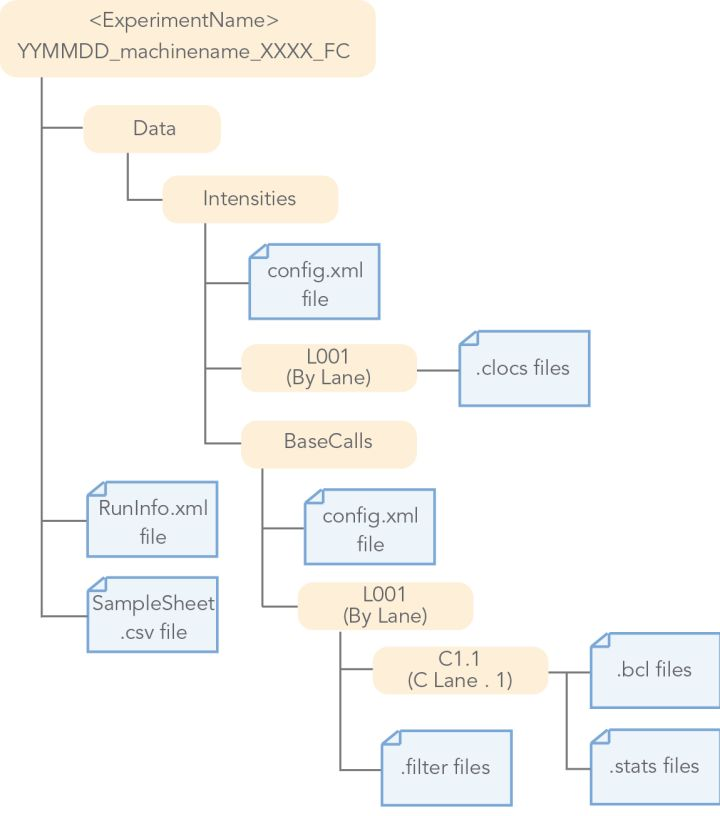
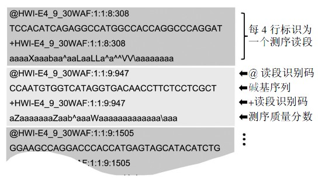
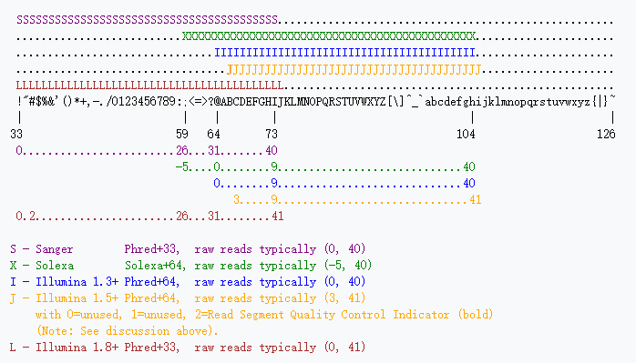

# 第一章 数据下机后的拆分

{:toc}

　　Illumina测序仪下机的数据通常为bcl格式，是将同一个测序通道（Lane）所有样品的数据混杂在一起的，Bcl文件，本质上是一个巨大图片。使用Illumina官方出品的Bcl2FastQ软件，可将bcl文件转换为fastq文件（依旧是多个sample的混合文件），再根据Index序列（一般为6个base的序列），将其拆分为单个样品的FastQ文件。

##  一、Illumina下机数据格式转化

示例：下机的数据为`180612_NB502066_0002_AH2CC7AFXY`

其格式为：



**illumina官方指导手册：**

- https://support.illumina.com/sequencing/sequencing_software/bcl2fastq-conversion-software.html

**command：**

```shell
nohup bcl2fastq  -R 180612_NB502066_0002_AH2CC7AFXY  -o fastq/180612_NB502066_0002_AH2CC7AFXY  --sample-sheet  wetlab/SampleSheet/180612_NB502066_0002_AH2CC7AFXY.csv --barcode-mismatches 1>log 2>&1  & 
```

其中 `180612_NB502066_0002_AH2CC7AFXY.csv`需要由湿实验室人员提供。

## 二、Fastq格式介绍



**维基百科的介绍：**

- 中文： https://zh.wikipedia.org/wiki/FASTQ%E6%A0%BC%E5%BC%8F
- 英文： https://en.wikipedia.org/wiki/FASTQ_format

fastq 文件中，每隔4行可以看作一个单位，其中:

>- 第1行主要储存序列测序时的坐标等信息
>
>```text
>@ST-E00126:128:HJFLHCCXX:2:1101:7405:1133
>
>@	开始的标记符号			
>ST-E00126:128:HJFLHCCXX	测序仪唯一的设备名称
>2	lane的编号				
>1101	tail的坐标
>7405	在tail中的X坐标
>1133	在tail中的Y坐标
>```
>
>- 第2行就是测序得到的序列信息，一般用ATCGN来表示，其中N表示荧光信号干扰无法判断到底是哪个碱基。
>- 第3行以“+”开始，可以储存一些附加信息，一般是空的。
>- 第4行储存的是质量信息，与第2行的碱基序列是一一对应的，其中的每一个符号对应的ASCII值成为phred值，可以简单理解为对应位置碱基的质量值，越大说明测序的质量越好。不同的版本对应的不同。
>
>--[FASTA 与 FASTQ格式详解](https://zhuanlan.zhihu.com/p/20714540)

### 1. 详细谈谈FASTQ质量值的计算方法

在测序仪进行测序的时候，会自动根据荧光信号的强弱给出一个参考的测序错误概率（error probility，P）根据定义来说，P值肯定是越小越好。我们怎么储存他们呢？直接储存成小数点？比如1%储存成0.01？这肯定是不高效的，因为1个碱基的信息，占用了至少4个字符。

所以科学家们的做法想了一个办法：

1.将P取log10之后再乘以-10，得到的结果为Q。

```text
比如，P=1%，那么对应的Q=-10*log10(0.01)=20
```

2.把这个Q加上33或者64转成一个新的数值，称为Phred，最后把Phred对应的ASCII字符对应到这个碱基。

```text
如Q=20，Phred = 20 + 33 = 53，对应的符号是”5”
```

- [ASCII对照表](https://zh.wikipedia.org/wiki/ASCII)


### 2. 各版本不同Phred对应的ASCII值

在计算Q值和加上33/64的时候，不同测序仪，产生的数据不同，大概如下所示：

- Solexa标准


- Illumina标准


### 3. 不同测序仪的不同Phred值对应的ASCII表，及其换算



不同测序平台给定的Phred值不同，各平台间测序质量换算如下：

```shell
# Command line conversions FASTQ to FASTA format:
zcat input_file.fastq.gz | awk 'NR%4==1{printf ">%s\n", substr($0,2)}NR%4==2{print}' > output_file.fa

# Illumina FASTQ 1.8 to 1.3
sed -e '4~4y/!"#$%&'\''()*+,-.\/0123456789:;<=>?@ABCDEFGHIJ/@ABCDEFGHIJKLMNOPQRSTUVWXYZ[\\]^_`abcdefghi/' myfile.fastq   # add -i to save the result to the same input file

# Illumina FASTQ 1.3 to 1.8
sed -e '4~4y/@ABCDEFGHIJKLMNOPQRSTUVWXYZ[\\]^_`abcdefghi/!"#$%&'\''()*+,-.\/0123456789:;<=>?@ABCDEFGHIJ/' myfile.fastq   # add -i to save the result to the same input file

# Illumina FASTQ 1.8 raw quality to binned quality (HiSeq Qtable 2.10.1, HiSeq 4000 )
sed -e '4~4y/!"#$%&'\''()*+,-.\/0123456789:;<=>?@ABCDEFGHIJKL/))))))))))----------77777<<<<<AAAAAFFFFFJJJJ/' myfile.fastq   # add -i to save the result to the same input file

# Illumina FASTQ 1.8 raw quality to clinto format (a visual block representation)
sed -e 'n;n;n;y/!"#$%&'\''()*+,-.\/0123456789:;<=>?@ABCDEFGHIJKL/▁▁▁▁▁▁▁▁▂▂▂▂▂▃▃▃▃▃▄▄▄▄▄▅▅▅▅▅▆▆▆▆▆▇▇▇▇▇██████/' myfile.fastq   # add -i to save the result to the same input file
```

## 三、 fastq文件的拆分

为了节约成本，测序通常为混合测序，测序仪器不过的信号也是多个样本混合的结果，为了区分各样本，在建库的时候引入了barcode index ，为不同样本加上不同的barcode index ，拆分是可通过 index 将其区分，最后生成各样本单独的index。**bcl2fastq可以在转化信号格式的时候直接获得拆分过的各sample的 fastq文件**。

- barcode index 
- adapter(这个留在指控环节再讲)

### 1. barcode 是样品标签

> 由于测序仪器的测序能力远大于测试样本序列量，为避免仪器浪费，因此一个lane同时测定多个样品成为很自然的思路。然而为了区分多种样品的序列，就必须要给不同样品加上特定的“标签”，从而可以在后续数据分析时将不同样品数据分开，而这个“标签”就是barcode。简言之，barcode就是测序中混合样品的”身份证“，用于区分不同样品。
>
>  [ 二代测序的barcode/index]( https://vip.biotrainee.com/d/65-barcode-index)

更详细的解释请参看：
- [Multiplexed Illumina sequencing libraries from picogram quantities of DNA](https://bmcgenomics.biomedcentral.com/articles/10.1186/1471-2164-14-466)

### 2. fastq文件拆分软件

对一份未拆分的fastq文件，可通过如下文件，实现拆分

相关软件：

- seqtk_demultiplex 

- [fastq-multx](https://github.com/brwnj/fastq-multx.git)


# 引用参考

- [How to demultiplex Illumina data and generate fastq files using bcl2fastq](http://bioinformatics.cvr.ac.uk/blog/tag/bcl2fastq/)
- [How to generate a Sample Sheet from sample/index data in BaseSpace](http://bioinformatics.cvr.ac.uk/blog/how-to-generate-a-sample-sheet-from-sampleindex-data-in-basespace/)
- [根据Barcode序列拆分fastq文件](https://www.plob.org/article/14515.html)
- [ 二代测序的barcode/index]( https://vip.biotrainee.com/d/65-barcode-index)
- [FASTA 与 FASTQ格式详解](https://zhuanlan.zhihu.com/p/20714540)

