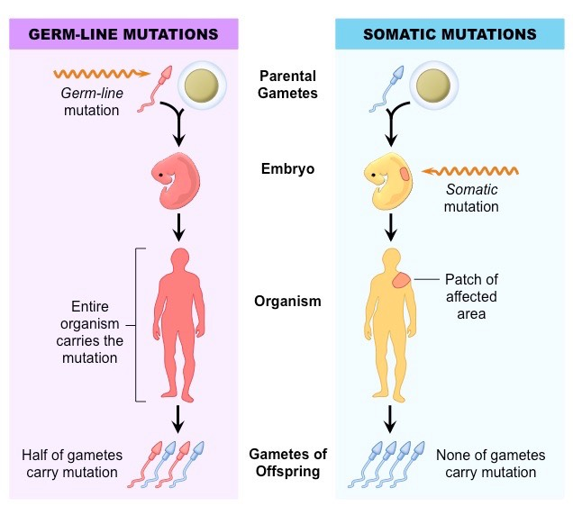
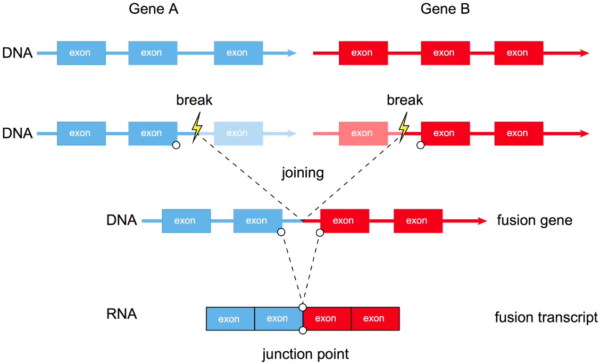
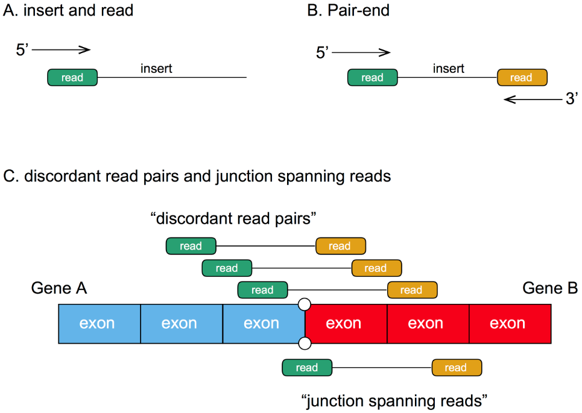

# 基因变异检测分析

{:toc}

目前，我们对癌症的定义为：癌症是一种基因病，癌症爆发的内在原因是基因突变。

那么，通过基因测序，找到突变位点，结合过往的研究报道+数据库，就能针对患者的个体状况，提供相关的辅助信息，帮助患者在癌症治疗中获益，这也是当下精准医疗中十分火热的一个项目。

说到基因变异检测分析，常见的检测分析项目主要包括:

- SNP/INDEL，fusion，CNV，MIS，TMB 等，其中检测SNP/INDEL应该是最低要求，其他的检测对数据有一定要求，并不是所有panel都能作的。

临床检测中，一个位点即使被确定为突变位点，也需要判断其是 somatic mutation 还是 germ-line mutation。这里简单解释一下，

- *somatic mutation （体细胞突变）* ：发生在单个体细胞中，不能遗传（只有来自突变细胞的组织受到影响），通常 call somatic mutations 的时候最好有同一个体的正常组织进行参照，一般为血液或者癌旁组织。
- *germ-line mutation（胚系突变）* ：发生在配子中并可传递给后代（整个生物体中的每个细胞都会受到影响）

1. SNP：**S**ingle **N**ucleotide **P**olymorphism，即单核苷酸多态性，是由于单个核苷酸改变（包括转换、颠换、缺失和插入）而导致的 DNA 序列多态性。
   1. 单核苷酸多态性（SNP）位点的分布是不均匀的，在非编码区比在编码区更常见。
   2. 单核苷酸多态性（SNP）等位基因的频率在不同人群中具有差异性，因此，常见于某地区或民族的单核苷酸多态性（SNP）等位基因在其他的地区或民族则可能很少见。
   3. 人类的DNA序列中平均每1000个碱基就会出现1至4个差异位点，称之为单一核苷酸多型性（Single Nucleotide Polymorphism；SNP）。
   4. 每3个SNP位点中有2个会是胞嘧啶（C）和胸腺嘧啶（T）的相互转变。
2. [INDEL](https://en.wikipedia.org/wiki/Indel): indel是一个由[**in**sertion](https://en.wikipedia.org/wiki/Insertion_(genetics)) or [**del**etion](https://en.wikipedia.org/wiki/Deletion_(genetics)) 组合的词，指基因组上小片段（<50bp）的插入或缺失，形同SNP/SNV。
3. SNV:相对于正常组织，癌症中特异的单核苷酸变异是一种体细胞突变（somatic mutation），称做SNV。
4. CNV：copy number variation，拷贝数变异，基因组拷贝数变异是基因组变异的一种形式，通常使基因组中大片段的DNA形成非正常的拷贝数量，可以类比染色体变异。
5. Fusion:
    - 什么是fusion：
    - 
    - 怎么检测fusion：
    - 
 6. MSI
     1. [文献](http://web.udl.es/usuaris/e4650869/docencia/segoncicle/genclin98/recursos_classe_(pdf)/revisionsPDF/MicrosatInstab.pdf)
     2. **微卫星**指的是广泛分布于原核和真核生物基因组中的短的串联重复序列，约占人类基因的10%，核心序列为1-6bp。多位于基因非编码区以及染色体的近端粒区，在人群中表现为高度多态性。
     3. **M**icro**s**atellite **I**nstability， 是[DNA错配修复](https://en.wikipedia.org/wiki/DNA_mismatch_repair)（MMR）受损导致的[遗传](https://en.wikipedia.org/wiki/Genetics)超突变（[突变](https://en.wikipedia.org/wiki/Mutation)倾向）的条件。MSI的存在代表了MMR不能正常运作的[表型](https://en.wikipedia.org/wiki/Phenotype)证据。MMR纠正[DNA复制](https://en.wikipedia.org/wiki/DNA_replication)过程中自发发生的错误，例如单碱基错配或短[插入](https://en.wikipedia.org/wiki/Insertion_(genetics))和[缺失](https://en.wikipedia.org/wiki/Deletion_(genetics))。参与MMR的蛋白质通过形成与DNA的错配部分结合的复合物来纠正[聚合酶](https://en.wikipedia.org/wiki/Polymerase)错误，从而消除错误，并在其位置插入正确的序列。[[1\]](https://en.wikipedia.org/wiki/Microsatellite_instability#cite_note-Ehrlich-1)具有异常功能的MMR的细胞无法纠正DNA复制过程中发生的错误，从而累积错误。这导致产生新的[微卫星](https://en.wikipedia.org/wiki/Microsatellite_(genetics))片段。
 7. TMB